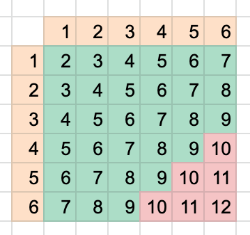

# 10 days of stats speedrun

`I stopped @ day 6. pretty disappointed in this challenge. not worth your time.`

--------------------------------------------------------

## answers to written questions

### day 2 basic probability

> In a single toss of  fair (evenly-weighted) six-sided dice, find the probability that their sum will be at most ___.

answer: 5/6

simple explanation: 36 total outcomes, 6 are undesirable

### day 2 more dice

> In a single toss of  fair (evenly-weighted) six-sided dice, find the probability that the values rolled by each die will be different and the two dice have a sum of ___.

same as graphic above, use table to see which add up to 6 (cannot include 3 + 3)

| two dice | 1 | 2 | 3 | 4  | 5  | 6  | 
|----------|---|---|---|----|----|----| 
| 1        | 2 | 3 | 4 | 5  | 6  | 7  | 
| 2        | 3 | 4 | 5 | 6  | 7  | 8  | 
| 3        | 4 | 5 | 6 | 7  | 8  | 9  | 
| 4        | 5 | 6 | 7 | 8  | 9  | 10 | 
| 5        | 6 | 7 | 8 | 9  | 10 | 11 | 
| 6        | 7 | 8 | 9 | 10 | 11 | 12 | 

### day 2 compound event probability

There are  urns labeled X, Y, and Z.
Urn X contains 4 red balls and 3 black balls.
Urn Y contains 5 red balls and 4 black balls.
Urn Z contains 4 red balls and 4 black balls.

> One ball is drawn from each of the 3 urns. What is the probability that, of the 3 balls drawn, 2 are red and 1 is black?

answer: 17/42

### day 2 conditional probability

> Suppose a family has 2 children, one of which is a boy. What is the probability that both children are boys?

1/3

https://www.hackerrank.com/challenges/s10-mcq-4/forum/comments/175934

> This is the first question I've ever encountered on Hackerrank that I was disappointed with. For one, the tutorial has no connection with the question. Moreover, the question itself is closer to a riddle, to a play on the ambguities of language rather than to being a legitimaite problem.

### day 3 cards of the same suit

You draw 2 cards from a standard 52-card deck without replacing them. What is the probability that both cards are of the same suit?

from https://www.hackerrank.com/challenges/s10-mcq-5/forum/comments/418190:

> No need to use combinations or permutations. There are 13 cards of each suit. Draw one card. It can be anything with probability of 1. Now there are 51 cards left and 12 of them are the same suit as the first card you drew. So the chance the second card matches the 1st is 12/51.

### day 3 drawing marbles

A bag contains 3 red marbles and 4 blue marbles. Then, 2 marbles are drawn from the bag, at random, without replacement. If the first marble drawn is red, what is the probability that the second marble is blue?

> The 1st and 2nd marble draw are unrelated. There are 6 total marbles remaining and 4 are blue.

> Answer: 4/6